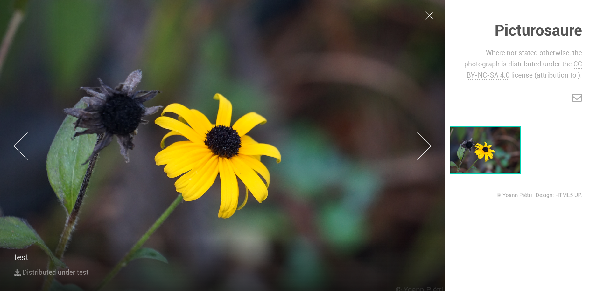

.. picturosaure documentation master file, created by
   sphinx-quickstart on Sat Aug  8 02:56:22 2020.
   You can adapt this file completely to your liking, but it should at least
   contain the root `toctree` directive.

Welcome to picturosaure's documentation!
========================================

Picturosaure is a small web application to share pictures.

This is documentation of version 0.1.

.. toctree::
   :maxdepth: 2
   :caption: Contents:

   installation
   configuration
   use_picturosaure

