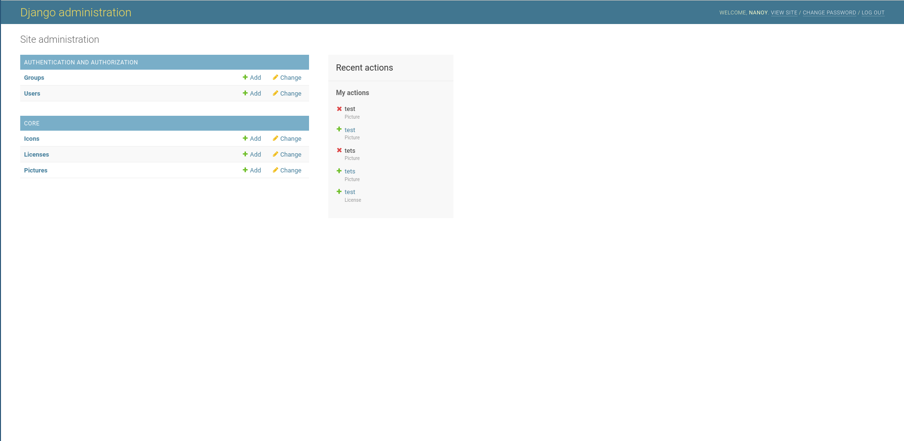
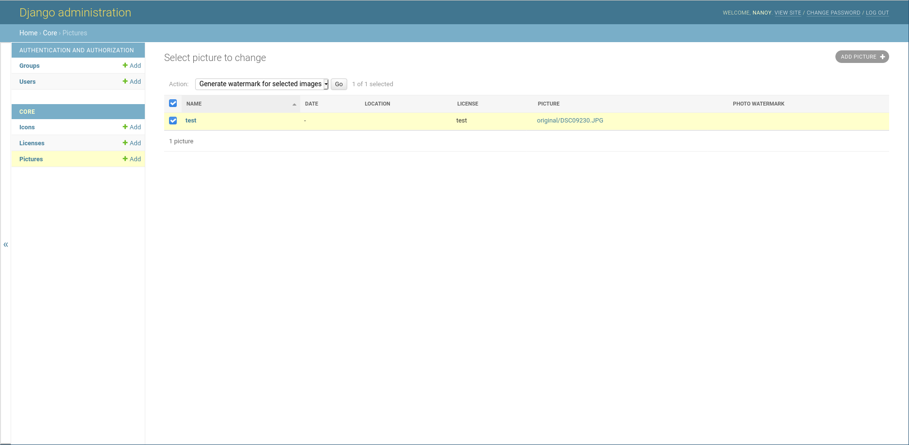

Use Picturosaure
================

Picturosaure is composed of a unique web page that display pictures. All the admin work is done in the django admin section.

If picturosaure runs at pictures.example.org you can access the admin panel at pictures.example.org/admin.

You will need an admin account, see installation for how to create a superuser account.

Icons
#####

Icons are displayed in the right panel.

An icon is composed of a name (which is not not displayed if everything is correct), a link and a font-awesome icon.
The font awesome icon should be the whole class, for example : ``fab fa-instagram``.

.. note::
    The mail icon is not handled here as django doesn't recognize it as a URL. It is handled through the ``PICTUROSAURE_CONTACT`` attribute.

Licenses
########

Pictures will have a corresponding license. If all your pictures are distributed under the same license, you will need to create the instance only once.

A license is just a name and a link to the full license text.

Pictures
########

Add pictures
************

When adding pictures, the following fields are mandatory: 

 * name : the name of the pictures
 * picture : the image
 * license : the license object

Optionally, you can add :

 * a small description
 * a date 
 * a location

Add watermarks
**************

.. warning::
    Adding watermarks is mandatory to display the picture on the front page. Otherwise it will just appear as black picture. If you don't want any watermark, please set ``PICTUROSAURE_USE_WATERMARK`` to ``False`` and generate the watermarks.

To generate watermarks, you have to select the corresponding pictures on the admin page and select the action 'Generate watermark for selected images'.

This operation can take a while depending on the picture's size.

If a selected pictures has already a watermark, it is deleted and a new one is generated.

Remove pictures
***************

If you remove pictures, the corresponding files are automatically deleted on the server.